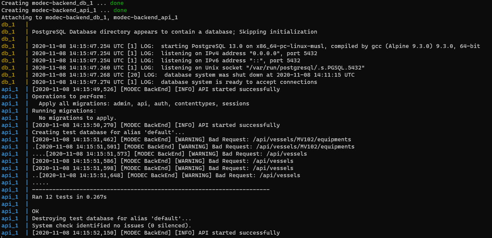

# MODEC BackEnd Technical Test

## Technologies

In the development of this project, the following technologies were used:

- [Python 3.7](https://www.python.org/downloads/release/python-370/)
- [Pip 20.2](https://pip.pypa.io/en/stable/news/#id12) 
- [Django 3.1](https://docs.djangoproject.com/en/3.1/releases/3.1/)
- [Django Rest Framework 3.12](https://www.django-rest-framework.org/community/release-notes/#312x-series)
- [PostgreSQL 13](https://www.postgresql.org/about/news/postgresql-13-released-2077/) (optional, if run in docker mode)
- [Docker 19.03](https://docs.docker.com/engine/release-notes/#version-1903) (optional, if run local mode)

More details about all libraries used can be found in [requirements.txt](requirements.txt) file. 

## How to run

There are two ways to run this project: [over Docker containers](#how-to-run---docker-recommended) or [locally](#how-to-run---local). 
Both ways work fine but **it's highly recommended
run over Docker** due the simplicity of installation process (only Docker itself is required).

## How to run - Docker (recommended)

To run this project over Docker container, everything you have to do is install Docker and 
run docker-compose (it comes with Docker by default). It will start automatically the API and PostgreSQL database, ready to use.

### Installation (docker)

To install Docker, visit [https://docs.docker.com/](https://docs.docker.com/) and follow the instructions related to your OS.

### Running (docker)

After install Docker, open your terminal/cmd, navigate to repository folder and execute the following command:

> docker-compose up --build

PS: even it's used only [Alpine images](https://hub.docker.com/_/alpine) to speed up the process, this command can take some minutes in the first time, 
since it will download postgres/python images and configure the whole environment. 
_So, it's perfect time to take a coffee_ 😅 
 
This command will start two containers:
- `modec-backend_db_1` the PostgreSQL container for database usage 
- `modec-backend_api_1` the Python container running Django application (it also apply migrations and run unit tests before start the API)

If you see the image bellow, it means that API is already running on http://localhost:8000 url:



## How to run - Local
To run this project locally, you will need to install everything manually (language, database and libraries/dependencies) in your OS.
 
### Installation (local)
The following steps are required in installation:
- Install Python (visit [https://www.python.org/](https://www.python.org/) and follow the instructions related to your OS);
- Install PostgreSQL (visit [https://www.postgresql.org/](https://www.postgresql.org/) and follow the instructions related to your OS)
- Install all dependencies:
    - Create a [virtual environment](https://docs.python.org/3/tutorial/venv.html) (Optional, if you want to isolate all libraries installed)
    - Open your terminal/cmd, navigate to repository folder and execute:
        > pip install -r requirements.txt
- Create `.env` file in repository folder:
```
### .env ###
# Project secret key
SECRET_KEY=modec-backend-api

# Debug mode (0 or 1)
DEBUG=1

# Allowed hosts
ALLOWED_HOSTS=localhost,0.0.0.0,127.0.0.1

# Database settings
DB_HOST=localhost
DB_PORT=5432
DB_NAME=modec
DB_USER=postgres
DB_PASS={your password here}
```
- Run database migrations:
    > python manage.py migrate 

### Running (local)

Once everything is installed successfully, run command to start application:
> python manage.py runserver 0.0.0.0:8000

If you see the image bellow, it means that API is already running on http://localhost:8000 url:


## API Design & Architecture

The API was designed according to [Restful API standard](https://restfulapi.net/), it means that the structure is organized by resources. 
There are two resources: **Vessel** and **Equipment**. Besides this, the architecture used is inherited from Django, which implements MVC and Domain-Driven design. 

### Vessels

The resource to obtain, create, update or delete vessels is represented by the following endpoints:
- `GET /api/vessels` to list all vessels;
- `GET /api/vessels/{code}` to get a specific vessel;
- `POST /api/vessels` to create a vessel;
- `PUT /api/vessels/{code}` to update a vessel;
- `DELETE /api/vessels/{code}` to delete a vessel;

Vessel json structure is defined by:
```json
{
  "code": "MV102"
}
```
### Equipments

The resource to obtain, create, update or delete equipments is represented by the following endpoints:
- `GET /api/vessels/{vessel_code}/equipments` to list all equipments from a vessel;
- `GET /api/vessels/{vessel_code}/equipments/{code}` to get a specific equipment from a vessel;
- `POST /api/vessels/{vessel_code}/equipments` to create an equipment in a vessel;
- `PUT /api/vessels/{vessel_code}/equipments/{code}` to update an equipment in a vessel;
- `DELETE /api/vessels/{vessel_code}/equipments/{code}` to delete an equipment in a vessel;
- `PUT /api/equipments/inactivate` to inactivate a list of equipments;
- `PUT /api/equipments/activate` to activate a list of equipments;

Equipment json structure is defined by:
```json
{
  "name": "compressor",
  "code": "5310B9D7",
  "location": "Brazil"
}
```

In case of activate/inactivate endpoints, the json structure is defined by:
```json
{
  "codes": ["MV102", "MV103"] 
}
```

### Postman

To interact easily with the API, a Postman collection with all endpoints and examples is available [here](MODEC-BackEnd-API.postman_collection.json). 
Instructions about how to import and use collections can be found [here](https://learning.postman.com/docs/getting-started/importing-and-exporting-data/). 

## Tests

Besides Postman tests (which check response time and status code), this project has unit tests for all endpoints.
To run the unit tests, execute the following command:
> python manage.py test

It will run [all tests](api/tests) regarding vessels and equipments endpoints.


